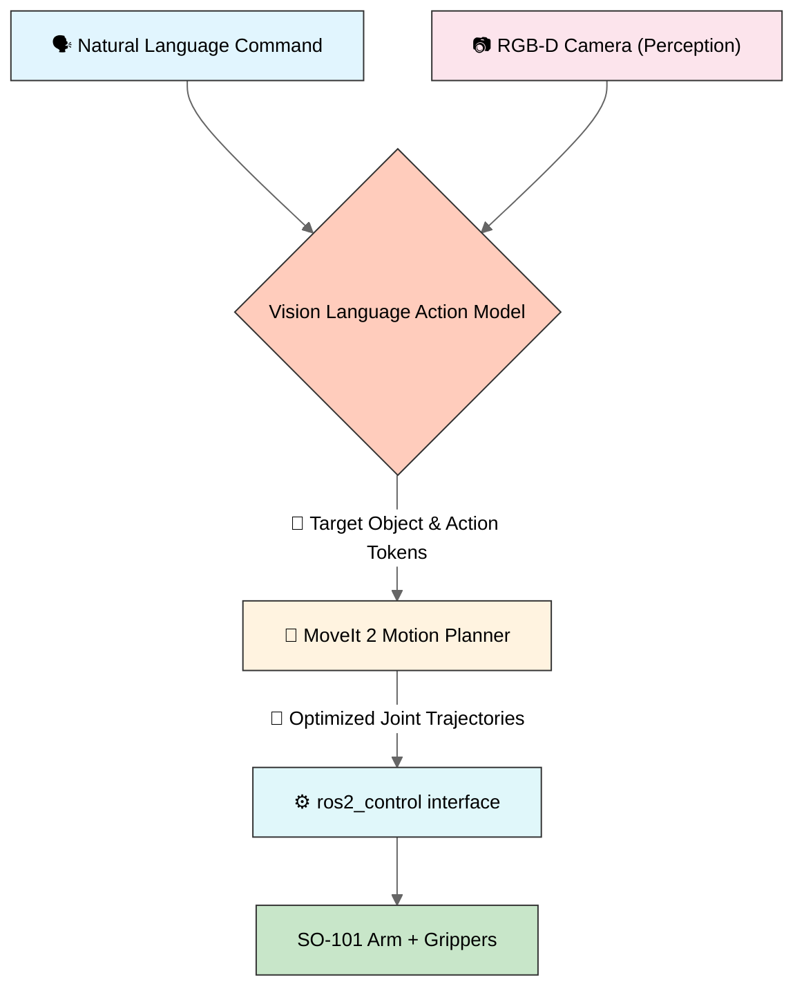

  
  <h1>lang2pick</h1>
  
  

    A language to action pipeline for so-101 manipulator 
  

  
  
<!-- Badges -->

  
  
  
  
  

   
<h4>
    <a href="https://github.com/shrujanus/lang2pick/tree/main/docs">View Demo</a>
   · 
    <a href="https://github.com/shrujanus/lang2pick/tree/main/docs">Documentation</a>
   · 
    <a href="https://github.com/shrujanus/lang2pick/issues">Report Bug</a>
   · 
    <a href="https://github.com/shrujanus/lang2pick/issues">Request Feature</a>
  </h4>

 

## 🌍 Inspiration

Growing up in India, I often saw plastic bottles, cans, wrappers, and recyclables littering the streets. It always felt like a **solvable problem**, what if only technology could lend a hand (literally)

This project was born from that simple idea:  
> **What if a robotic arm could autonomously identify and pick up recyclables, cleaning our environment, one object at a time?**

  

lang2pick is a step toward that: by using an **open-source arm (SO-101)**  we then combines **natural language understanding**, **vision-language-action modes**, and **motion planning** to enable real-world pick-and-place tasks

## 🚀 Overview

**SO-101 ROS2** is an experiment for building **general-purpose robotic manipulators** using the **SO-101 robotic arm**. It enables **natural language-driven pick-and-place** operations via a complete software stack:

> **Example Command:**  
> _“Pick up all recyclables and place them in the blue recycling bin”_

The system bridges the full pipeline:  
**Language → Perception → Action Planning → Hardware Execution**

### 🎯 End Goal
Provide developers with a **plug-and-play platform** to:
- Fine-tune **Vision-Language-Action (VLA)** models
- Control **any ROS2-compatible robotic arm** via `ros2_control`
- Perform **robust pick-and-place** tasks in simulation and reality (sim-to-real)

## 🧠 System Architecture

## 📁 Project Structure

| Directory | Description |
|------------|-------------|
| `ros2_ws/` | ROS2 workspace containing robot description, MoveIt2 configuration, controller setup, hardware interface nodes and simulation |
| `vla/` | Vision-Language(-Action) module — converts VLA outputs (object/action tokens) into ROS2 commands for MoveIt2 |
| `scripts/` | Training and fine-tuning pipeline for the Vision-Language model (using **PyTorch** and **LeRobot**) |
| `docs/` | Documentation, diagrams, and setup guides for developers and contributors |

## 🧩 Tech Stack

- **ROS2 Humble** — Core robotics framework  
- **MoveIt2** — Inverse kinematics and motion planning  
- **PyTorch + LeRobot** — Vision-Language training & fine-tuning  
- **Gazebo / MuJoCo Sim** — Physics simulation and visualization  

## 🤝 [Contributing](CONTRIBUTING.md)

Contributions are welcome! Whether you want to help with ROS2 development, dataset collection, or model training — feel free to open an issue or a PR.  

## 📜 License

This project is open-source and licensed under the [Apache License](LICENSE).

## ⭐ Acknowledgements

This project builds on the shoulders of open-source giants —  
**MoveIt2**, **ROS2**, **PyTorch**, **LeRobot**, and the amazing open-source robotics community.
